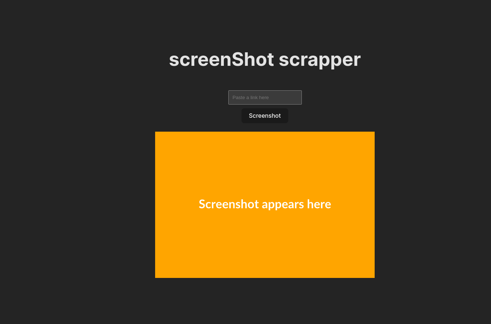
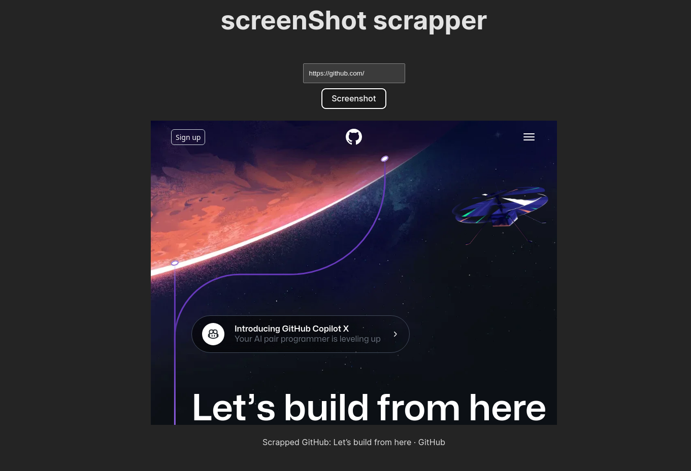

# Scrapper Application

The Scrapper Application is a tool that allows users to take screenshots of web pages and save them for future reference.





## Features

- Capture screenshots of web pages
- Save screenshots locally
- Display the captured screenshots in the application

## Technologies Used

The Scrapper Application is built using the following technologies:

- Frontend:
  - React: JavaScript library for building user interfaces
  - Ant Design: UI library for React applications
  - Axios: HTTP client for making API requests

- Backend:
  - Node.js: JavaScript runtime environment
  - Express: Web application framework for Node.js
  - Puppeteer: Headless browser for web scraping and automation

## Getting Started

To run the Scrapper Application locally, follow these steps:

1. Clone the repository:

   ```bash
    git clone <repository-url>
   ```
2. Change to the project directory:

    ```bash
     cd scrapper
    ```
3. Start the backend server:
    ```bash
        npm i
        npm run serve
    ```
4. Start the frontend development server:

    ```bash
    cd client
    npm i
    npm run dev
    ```
## Usage

- Enter a URL in the input field to specify the web page you want to capture a screenshot of.

- Click the "Screenshot" button to initiate the process.

- The application will display a loading message while capturing the screenshot.

- Once the screenshot is taken, it will be displayed on the screen.

## Contributing

- Contributions are welcome! If you have any suggestions, bug reports, or feature requests, please open an issue or submit a pull request.

## License

This project is licensed under the [MIT License](https://chat.openai.com/c/LICENSE).


- Feel free to modify and customize the content according to your specific scrapper application.
